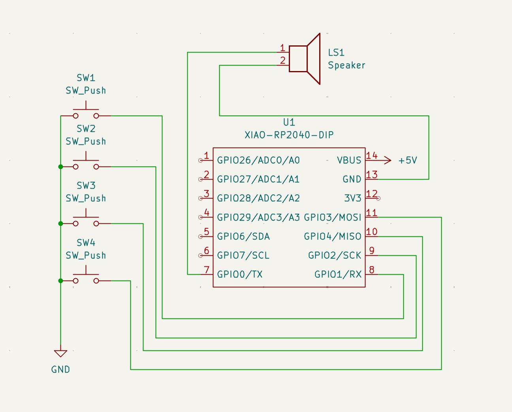
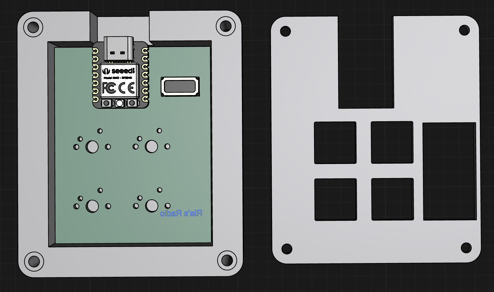

# Ria's Radio

Here's my submission for my radio!

### What does it do?
- For each key, a different note is played

### Challenges 
- It was my first time ever making a schematic or a 3d model, so it was very challenging to figure out how the applications function and how to use the numerous tools. But at the end of it, I became pretty good at using Shapr3D and in the future I hope to use it more to make models. 

### PCB

Here is a picture of my schematic and PCB: 

Schematic            |  PCB         |
:-------------------------:|:-------------------------:|
    |    | 

### CAD Model

This was made in Shapr3D. 

### Firmware

The firmware was made in VS Code using KMK. 

### BOM

- 1 XIAO RP2040
- 4 Blank DSA Keycaps
- 4 Cherry MX Switches

1 LS1 speaker (provided by me)

